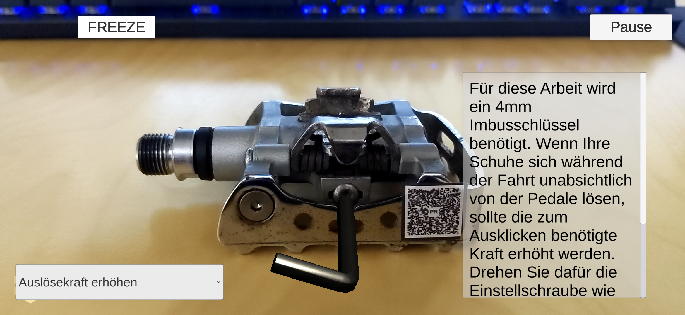

# Bicycle Maintenance AR App

## Introduction
This AR solution can help you to maintain or repair your bicycle by yourself. There are two different modes:
- Discover Mode
- Maintenance Mode

## Get Started

### Deployment
- this application was build with Unity 2019.4.17f1 (LTS version)
- to build the App the Vuforia plugin for Unity is required
- if the Vuforia license is expired, you have to create your own account
- you can deploy the application on Android, IOS and PC
- if you want to start the application on PC, you first have to open the scene named `MainMenu` under `Assets/Scenes`

## Run the App
- before you can start using the app you have to prepare your bicycle
- print the [marker](Assets/Marker) and place them on your bike's compoenents
- now you can start using the app

 If you dont't want to use image targets you can also use object target to detect the components of your bicycle. To create new object targets you have to [download](https://library.vuforia.com/articles/Training/Vuforia-Object-Scanner-Users-Guide.html) the 'Vuforia Scanner App':
 - after you have created a new object target you can import it into the Scene `ComponentDiscovery`. There you can find an example object target named `LeftPedalObjectTarget`. There you can see which scripts should be added to the new target and how it should be configured.

## Discover Mode
Here you can discover the maintenance and repair options of each component by your own. After a component was scanned, a description text and a dropdown menu appear on the UI. Here you can see some general information about the component. In the dropdown menu you can choose between the different maintenance/ repair options. The instructions are described as text and addtionally there are 3D objects dropped on the camera scene. The 3D objects support the instructions of the maintenace step. E.g. a screwdriver is placed on the screw mentioned in the instruction text and is turning in the correct direction to reach the goal of mainteance/repair step.

## Maintenance Mode
In this mode you can choose a specific component you want to maintain. Then you are guided throw the maintenance step by step.

